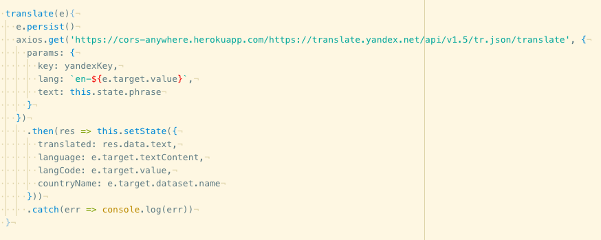
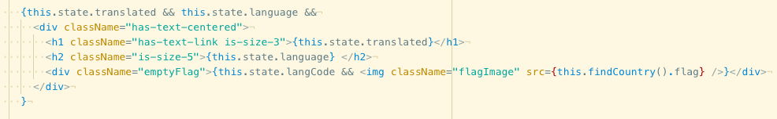

# Project 2: Random Phrase Translator

2 days long pair project using only React and Axios for API.

## Theme

I'm very interested in different languages and have always wanted to know how each specific thing we speak in English might look like in different languages.

## Controls

Pick a new random phrase or write your own words/sentence.
Press on the language to be translated into.

## Stack Overview

###### APIs

I used two APIs for this project, Yandex, the translator service that requires sign up, and the restcountries API, which contains a lot of top-of-the-line info about every country.

###### Translation

After signing up, the Yandex service requires a key (given to me during sign up) on every request I send to the service. I keep this key elsewhere in an environment file to keep safe, and its referred to when I need it.

###### Sending a GET request to yandex with their required parameters, and then convert the response into state for React to show on the page.

###### I used the restcountries API to get the country flag to display alongside the translation. The data changes in the state every time a new language is selected.

###### Each option contains the key used to make the request to the Yandex server.

